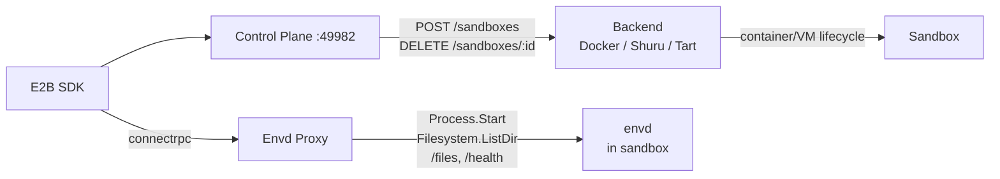

# Sandbox

E2B-compatible sandbox control plane. Use the standard [E2B SDK](https://github.com/e2b-dev/e2b) with local Docker containers, Shuru microVMs, or Tart macOS VMs — swap to real E2B in production by changing one URL.

## Backends

| | Docker | Shuru | Tart |
|---|---|---|---|
| **Technology** | Linux containers | macOS microVMs (Apple Virt) | macOS VMs (Apple Virt) |
| **Platform** | All | macOS only | macOS only |
| **Guest OS** | Linux | Alpine Linux | macOS |
| **Isolation** | Namespace/cgroup | Hardware VM | Hardware VM |
| **Pause/resume** | Yes | No (ephemeral) | Yes (suspend/resume) |
| **Status** | Default | Supported | Supported |

See [docs/container-runtimes.md](docs/container-runtimes.md) for detailed backend comparison.

## Quick Start

### Docker (default)

```bash
# Build the base image
docker build -t sandbox-base:latest docker/sandbox

# Install
brew install circlesac/tap/sandbox
# or: npx @circlesac/sandbox

# Start (auto-generates API key on first run)
sandbox serve
```

### Shuru (Linux microVMs on macOS)

```bash
brew install shuru
shuru checkpoint create sandbox-base --allow-net -- sh -c '...'

# Set backend
# ~/.sandbox/config.json → { "backend": "shuru" }
sandbox serve
```

### Tart (macOS VMs)

```bash
# Install Tart and pull macOS base image (~24GB, one-time)
brew install cirruslabs/cli/tart
tart clone ghcr.io/cirruslabs/macos-sequoia-base:latest sandbox-base

# Build envd-lite (requires Go, protoc)
cd envd-lite
go generate ./...        # generate protobuf Go code from upstream .proto files
go build -o envd-lite .

# Start
SANDBOX_BACKEND=tart sandbox serve
```

Each sandbox clones the base VM, boots it, deploys envd-lite via SSH, and proxies the E2B SDK to it. VM creation takes ~30-60s depending on host CPU.

## Usage

The E2B SDK works the same across all backends:

```typescript
import Sandbox from "e2b";

const sandbox = await Sandbox.create("base", {
  apiUrl: "http://localhost:49982",
  apiKey: "sk-...",
});

// Run commands
const result = await sandbox.commands.run("echo hello");
console.log(result.stdout); // "hello\n"

// File I/O
await sandbox.files.write("/tmp/test.txt", "hello");
const content = await sandbox.files.read("/tmp/test.txt");

// Cleanup
await sandbox.kill();
```

## Architecture



## Development

```bash
cd cli
bun install
bun run dev serve     # run server in dev mode
npx vitest run        # unit + integration tests
bun run typecheck
```

## Project Structure

```
cli/                  # Control plane server + CLI
  src/server/         # Hono API server, sandbox service, proxy
  src/server/services/
    docker.ts         # Docker backend
    shuru.ts          # Shuru backend
    tart.ts           # Tart backend
  test/               # Unit + integration tests
envd-lite/            # Minimal envd for macOS VMs (Go, connectrpc)
docker/sandbox/       # Docker base image
docs/                 # Backend comparison docs
```
