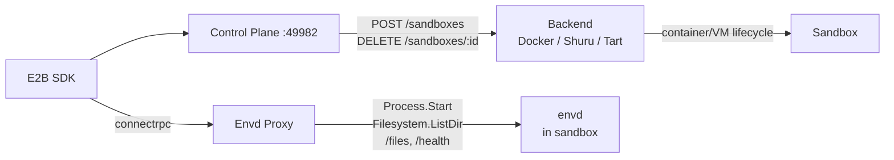

# Sandbox

E2B-compatible sandbox control plane. Use the standard [E2B SDK](https://github.com/e2b-dev/e2b) with local Docker containers, Shuru microVMs, or Tart macOS VMs — swap to real E2B in production by changing one URL.

## Backends

| | Docker | Shuru | Tart |
|---|---|---|---|
| **Technology** | Linux containers | macOS microVMs (Apple Virt) | macOS VMs (Apple Virt) |
| **Platform** | All | macOS only | macOS only |
| **Guest OS** | Linux | Alpine Linux | macOS |
| **Isolation** | Namespace/cgroup | Hardware VM | Hardware VM |
| **Pause/resume** | Yes | No (ephemeral) | Yes (suspend/resume) |
| **Status** | Default | Supported | Supported |

See [docs/container-runtimes.md](docs/container-runtimes.md) for detailed backend comparison.

## Quick Start

### Docker (default)

```bash
# Build the base image
docker build -t sandbox-base:latest docker/sandbox

# Install
brew install circlesac/tap/sandbox
# or: npx @circlesac/sandbox

# Start (auto-generates API key on first run)
sandbox serve
```

### Persistent Docker Desktop control plane

To run the control plane itself in Docker on macOS, enable **Host networking**
under Docker Desktop's **Settings → Resources → Network** and enable Docker at
login. Then start only the sandbox service:

```bash
docker build -t sandbox-base:latest docker/sandbox
docker compose build --no-cache sandbox
docker compose up -d sandbox
```

The Compose service mounts the Docker socket and `~/.sandbox`, listens on the
host's port `49982`, and restores itself after Docker Desktop or the Mac
restarts. Use `docker compose ps sandbox` and `sandbox status` to verify both
the container and the E2B control plane.

The service intentionally uses `restart: always`, not `unless-stopped`.
Docker Desktop marks restored containers as stopped during a clean restart,
and its host-network forwarder becomes ready after the Docker engine. The
Compose startup command records the Docker VM boot ID, waits 12 seconds, and
restarts the control plane once per VM boot so port `49982` is attached after
host networking is ready. Keep that startup guard when changing the service.

### Shuru (Linux microVMs on macOS)

```bash
brew install shuru
shuru checkpoint create sandbox-base --allow-net -- sh -c '...'

# Set backend
# ~/.sandbox/config.json → { "backend": "shuru" }
sandbox serve
```

### Tart (macOS VMs)

```bash
# Install Tart and pull macOS base image (~24GB, one-time)
brew install cirruslabs/cli/tart
tart clone ghcr.io/cirruslabs/macos-sequoia-base:latest sandbox-base

# Build and install envd-lite into base image (one-time)
cd envd-lite
go generate ./...
go build -o envd-lite .
# See CONTRIBUTING.md for base image setup with envd-lite pre-installed

# Start with macOS support alongside Docker
SANDBOX_MACOS_BACKEND=tart sandbox serve
```

envd-lite is pre-installed in the base image with a LaunchAgent, so each sandbox only needs to clone the VM and boot it. VM creation takes ~30-60s depending on host CPU.

### Public endpoint for a local control plane

When a remote Padawan, Worker, or test runner needs to reach a local control
plane, expose port `49982` with a stable per-device hostname. Derive the suffix
from the Mac's hardware serial so multiple machines do not claim the same DNS
record:

```bash
DEVICE_HASH="$(printf '%s' "$(ioreg -rd1 -c IOPlatformExpertDevice | awk -F'"' '/IOPlatformSerialNumber/{print $4}')" | shasum -a 256 | cut -c1-8)"
cgrok http 49982 --url "sandbox-${DEVICE_HASH}.crcl.es"
```

Use `https://sandbox-${DEVICE_HASH}.crcl.es` for both the E2B SDK's `apiUrl`
and `sandboxUrl`. This is a physical-device naming convention for the control
plane, not a Docker-only or per-container hostname. Do not omit `--url` for a
long-lived endpoint: cgrok otherwise generates a new random hostname.

## Usage

The E2B SDK works the same across all backends. Use `metadata.platform` to select the platform:

```typescript
import Sandbox from "e2b";

const opts = {
  apiUrl: "http://localhost:49982",
  apiKey: "sk-...",
  validateApiKey: false,
};

// Linux sandbox (default)
const linux = await Sandbox.create("base", opts);
const result = await linux.commands.run("uname");
// → "Linux"

// macOS sandbox
const macos = await Sandbox.create("base", {
  ...opts,
  metadata: { platform: "macos" },
});
const result2 = await macos.commands.run("sw_vers -productName");
// → "macOS"
```

Recent E2B SDKs validate official Cloud keys as `e2b_<hex>` before making a
request. `circlesac/sandbox` uses its own authenticated `sk-sandbox-*` keys, so
custom-control-plane clients must set `validateApiKey: false`. This disables
only the SDK's local prefix check; the control plane still authenticates the
key. For Padawan's PTY smoke, use the equivalent environment setting:

```bash
E2B_VALIDATE_API_KEY=false \
SANDBOX_API_URL=http://localhost:49982 \
SANDBOX_API_KEY="$(jq -r .apiKey ~/.sandbox/config.json)" \
bun run smoke:pty
```

## Architecture



See [CONTRIBUTING.md](CONTRIBUTING.md) for development setup and project structure.
