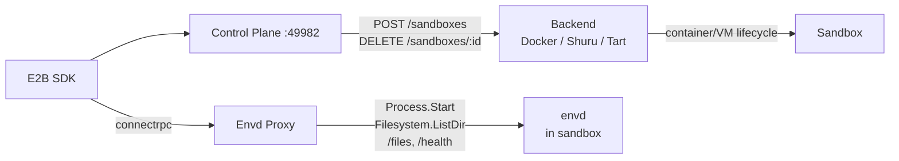

# Sandbox

E2B-compatible sandbox control plane. Use the standard [E2B SDK](https://github.com/e2b-dev/e2b) with local Docker containers, Shuru microVMs, or Tart macOS VMs — swap to real E2B in production by changing one URL.

## Backends

| | Docker | Shuru | Tart |
|---|---|---|---|
| **Technology** | Linux containers | macOS microVMs (Apple Virt) | macOS VMs (Apple Virt) |
| **Platform** | All | macOS only | macOS only |
| **Guest OS** | Linux | Alpine Linux | macOS |
| **Isolation** | Namespace/cgroup | Hardware VM | Hardware VM |
| **Pause/resume** | Yes | No (ephemeral) | Yes (suspend/resume) |
| **Status** | Default | Supported | Supported |

See [docs/container-runtimes.md](docs/container-runtimes.md) for detailed backend comparison.

## Quick Start

### Docker (default)

```bash
# Build the base image
docker build -t sandbox-base:latest docker/sandbox

# Install
brew install circlesac/tap/sandbox
# or: npx @circlesac/sandbox

# Start (auto-generates API key on first run)
sandbox serve
```

### Persistent OrbStack control plane

To run the control plane itself in Docker on macOS, start OrbStack at login and
launch the sandbox service with the OrbStack Docker context:

```bash
docker --context orbstack build -t sandbox-base:latest docker/sandbox
docker --context orbstack compose build --no-cache sandbox
docker --context orbstack compose up -d sandbox
```

The Compose service mounts the Docker socket and `~/.sandbox`, listens on the
host's port `49982`, and uses `restart: always` so OrbStack restores it after
login or reboot. Use `docker --context orbstack compose ps sandbox` and
`sandbox status` to verify both the container and the E2B control plane.

The service intentionally uses `restart: always`, not `unless-stopped`, so it
returns whenever the OrbStack Docker engine starts.

### Shuru (Linux microVMs on macOS)

```bash
brew install shuru
shuru checkpoint create sandbox-base --allow-net -- sh -c '...'

# Set backend
# ~/.sandbox/config.json → { "backend": "shuru" }
sandbox serve
```

### Tart (macOS VMs)

```bash
# Install Tart and pull macOS base image (~24GB, one-time)
brew install cirruslabs/cli/tart
tart clone ghcr.io/cirruslabs/macos-sequoia-base:latest sandbox-base

# Build and install envd-lite into base image (one-time)
cd envd-lite
go generate ./...
go build -o envd-lite .
# See CONTRIBUTING.md for base image setup with envd-lite pre-installed

# Start with macOS support alongside Docker
SANDBOX_MACOS_BACKEND=tart sandbox serve
```

envd-lite is pre-installed in the base image with a LaunchAgent, so each sandbox only needs to clone the VM and boot it. VM creation takes ~30-60s depending on host CPU.

### Public endpoint for a local control plane

When a remote Padawan, Worker, or test runner needs to reach a local control
plane, run `cloudflared` in the same Docker Compose project. Derive a stable
per-device hostname from the Mac's hardware serial so multiple machines do not
claim the same DNS record:

```bash
SANDBOX_DEVICE_HASH="$(printf '%s' "$(ioreg -rd1 -c IOPlatformExpertDevice | awk -F'"' '/IOPlatformSerialNumber/{print $4}')" | shasum -a 256 | cut -c1-8)"
SANDBOX_TUNNEL_NAME="sandbox-${SANDBOX_DEVICE_HASH}"
SANDBOX_PUBLIC_HOSTNAME="sandbox-${SANDBOX_DEVICE_HASH}.crcl.es"

# One-time Cloudflare setup. `login` writes the local management certificate;
# the token file is the only credential mounted into the runtime container.
cloudflared tunnel login
cloudflared tunnel create "$SANDBOX_TUNNEL_NAME"
cloudflared tunnel route dns "$SANDBOX_TUNNEL_NAME" "$SANDBOX_PUBLIC_HOSTNAME"
cloudflared tunnel token "$SANDBOX_TUNNEL_NAME" > ~/.sandbox/cloudflared-tunnel-token
chmod 600 ~/.sandbox/cloudflared-tunnel-token

docker --context orbstack compose up -d cloudflared
docker --context orbstack compose ps sandbox cloudflared
curl -fsS "https://${SANDBOX_PUBLIC_HOSTNAME}/health"
```

The `cloudflared` container routes the tunnel to `http://localhost:49982`, uses
host networking, waits for the sandbox health check, and has `restart: always`,
so OrbStack restores both services after login or reboot. Never commit
the token file or pass it on the command line.

Use `https://sandbox-${SANDBOX_DEVICE_HASH}.crcl.es` for both the E2B SDK's `apiUrl`
and `sandboxUrl`. This is a physical-device naming convention for the control
plane, not a Docker-only or per-container hostname.

## Usage

The E2B SDK works the same across all backends. Use `metadata.platform` to select the platform:

```typescript
import Sandbox from "e2b";

const opts = {
  apiUrl: "http://localhost:49982",
  apiKey: "sk-...",
  validateApiKey: false,
};

// Linux sandbox (default)
const linux = await Sandbox.create("base", opts);
const result = await linux.commands.run("uname");
// → "Linux"

// macOS sandbox
const macos = await Sandbox.create("base", {
  ...opts,
  metadata: { platform: "macos" },
});
const result2 = await macos.commands.run("sw_vers -productName");
// → "macOS"
```

Recent E2B SDKs validate official Cloud keys as `e2b_<hex>` before making a
request. `circlesac/sandbox` uses its own authenticated `sk-sandbox-*` keys, so
custom-control-plane clients must set `validateApiKey: false`. This disables
only the SDK's local prefix check; the control plane still authenticates the
key. For Padawan's PTY smoke, use the equivalent environment setting:

```bash
E2B_VALIDATE_API_KEY=false \
SANDBOX_API_URL=http://localhost:49982 \
SANDBOX_API_KEY="$(jq -r .apiKey ~/.sandbox/config.json)" \
bun run smoke:pty
```

## Architecture



See [CONTRIBUTING.md](CONTRIBUTING.md) for development setup and project structure.
