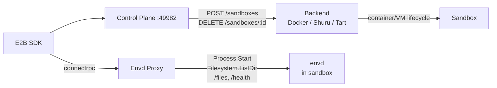

# Sandbox

E2B-compatible sandbox control plane. Use the standard [E2B SDK](https://github.com/e2b-dev/e2b) with local Docker containers, Shuru microVMs, or Tart macOS VMs — swap to real E2B in production by changing one URL.

## Backends

| | Docker | Shuru | Tart |
|---|---|---|---|
| **Technology** | Linux containers | macOS microVMs (Apple Virt) | macOS VMs (Apple Virt) |
| **Platform** | All | macOS only | macOS only |
| **Guest OS** | Linux | Alpine Linux | macOS |
| **Isolation** | Namespace/cgroup | Hardware VM | Hardware VM |
| **Pause/resume** | Yes | No (ephemeral) | Yes (suspend/resume) |
| **Status** | Default | Supported | Supported |

See [docs/container-runtimes.md](docs/container-runtimes.md) for detailed backend comparison.

## Quick Start

### Docker (default)

```bash
# Build the base image
docker build -t sandbox-base:latest docker/sandbox

# Install
brew install circlesac/tap/sandbox
# or: npx @circlesac/sandbox

# Start (auto-generates API key on first run)
sandbox serve
```

### Shuru (Linux microVMs on macOS)

```bash
brew install shuru
shuru checkpoint create sandbox-base --allow-net -- sh -c '...'

# Set backend
# ~/.sandbox/config.json → { "backend": "shuru" }
sandbox serve
```

### Tart (macOS VMs)

```bash
# Install Tart and pull macOS base image (~24GB, one-time)
brew install cirruslabs/cli/tart
tart clone ghcr.io/cirruslabs/macos-sequoia-base:latest sandbox-base

# Build and install envd-lite into base image (one-time)
cd envd-lite
go generate ./...
go build -o envd-lite .
# See CONTRIBUTING.md for base image setup with envd-lite pre-installed

# Start with macOS support alongside Docker
SANDBOX_MACOS_BACKEND=tart sandbox serve
```

envd-lite is pre-installed in the base image with a LaunchAgent, so each sandbox only needs to clone the VM and boot it. VM creation takes ~30-60s depending on host CPU.

## Usage

The E2B SDK works the same across all backends. Use `metadata.platform` to select the platform:

```typescript
import Sandbox from "e2b";

const opts = {
  apiUrl: "http://localhost:49982",
  apiKey: "sk-...",
};

// Linux sandbox (default)
const linux = await Sandbox.create("base", opts);
const result = await linux.commands.run("uname");
// → "Linux"

// macOS sandbox
const macos = await Sandbox.create("base", {
  ...opts,
  metadata: { platform: "macos" },
});
const result2 = await macos.commands.run("sw_vers -productName");
// → "macOS"
```

## Architecture



See [CONTRIBUTING.md](CONTRIBUTING.md) for development setup and project structure.
